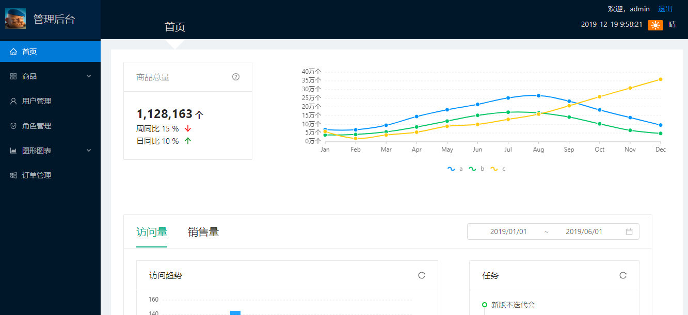
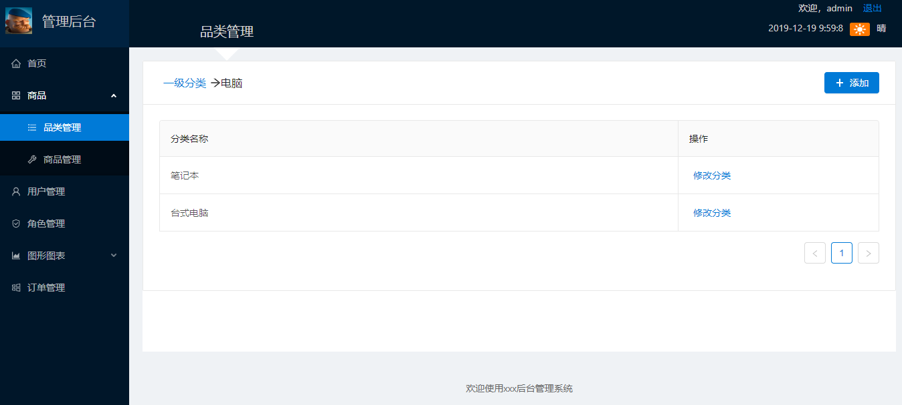
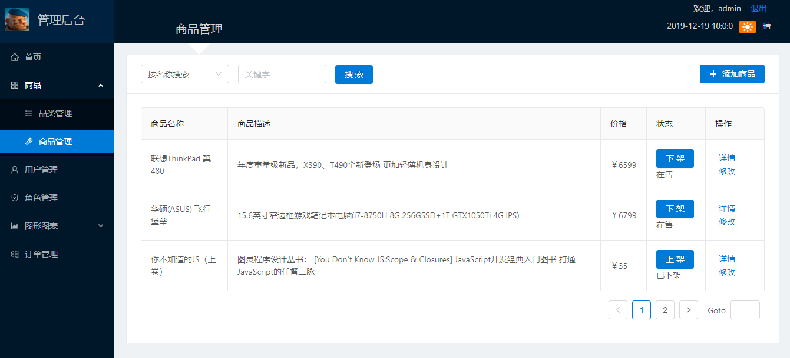
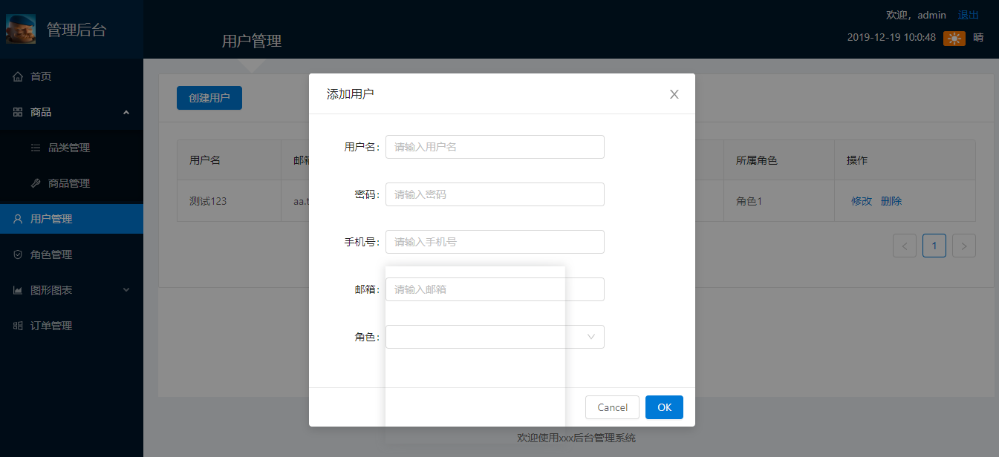
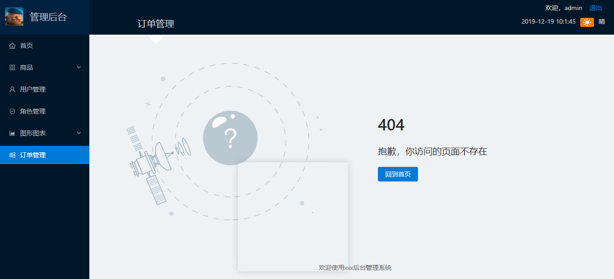

<h1 style="text-align: center">admin 后台管理系统</h1>

#### 项目简介
基于react、antd、node、express 的前后端分离的后台管理系统支持前端菜单动态路由

**账号密码** ```admin/admin```(默认密码都是admin)

#### 项目源码

|     |   后端源码  |   前端源码  |
|---  |--- | --- |
|  github   |  https://github.com/Clover6/manager-admin-server   |  https://github.com/Clover6/manager-admin   |
|  码云   |  https://gitee.com/Clover6/manager-admin-server   |  https://gitee.com/Clover6/manager-admin   |

#### 系统预览
<table>
    <tr>
        <td></td>
        <td></td>
    </tr>
    <tr>
        <td></td>
        <td></td>
    </tr>
    <tr>
        <td></td>
        <td></td>
    </tr>
</table>
